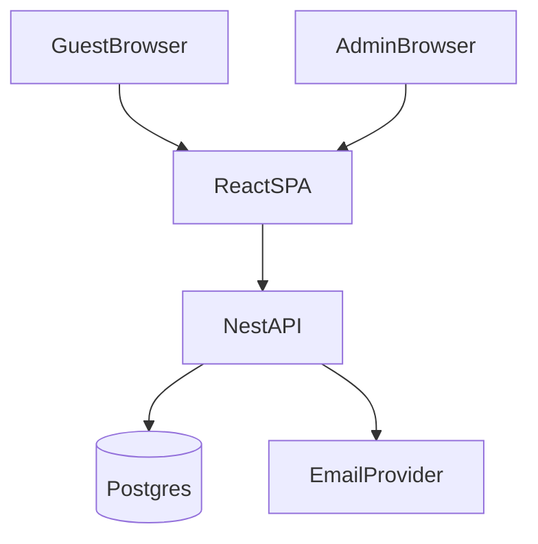

# Plan triển khai web mời khách phòng trà (React SPA + BE + mật khẩu cố định)

## Mục tiêu MVP

- **FE public**: Landing → Flow 4 bước: chọn địa điểm/suất diễn → nhập thông tin → số lượng khách → xác nhận.
- **Giới hạn chỗ**: chặn đăng ký vượt capacity theo từng suất diễn (đảm bảo đúng khi submit đồng thời).
- **Email**: gửi email xác nhận đăng ký.
- **Admin**: CRUD địa điểm & suất diễn, xem danh sách đăng ký, export CSV.
- **Tách mật khẩu** (cố định, cấu hình ở BE `.env`):
  - **GuestPassword**: bắt buộc nhập trước khi vào `/register`.
  - **AdminPassword**: bắt buộc nhập trước khi vào `/admin/`*.
  - **Nhớ theo session**: refresh trang vẫn còn, nhưng nếu đóng browser thì nhập lại.

## Stack

- **Frontend**: React SPA (Vite) + TypeScript + React Router + TailwindCSS + shadcn/ui.
- **Backend**: NestJS + TypeScript.
- **DB**: PostgreSQL + Prisma.
- **Email provider**: Resend (khuyến nghị) hoặc SendGrid/Mailgun.
- **Deploy**: FE static lên Vercel/Netlify/Cloudflare Pages; BE lên Render/Fly.io; DB lên Neon/Supabase.

## Kiến trúc tổng quan

- Monorepo:
  - [`apps/web`](apps/web) (Vite React)
  - [`apps/api`](apps/api) (NestJS)
  - [`packages/db`](packages/db) (Prisma)
  - [`packages/shared`](packages/shared) (types + zod)

## Mật khẩu cố định: cách làm an toàn

> Không hardcode mật khẩu trong FE (ai cũng xem được bundle JS). Mật khẩu nằm trong **BE env**.

### Cơ chế xác thực (session-only)

- FE có 2 màn nhập password:
  - `/register/access` (GuestPassword)
  - `/admin/login` (AdminPassword)
- Khi nhập đúng, BE trả **JWT access token** ngắn hạn (ví dụ 2–8 giờ).
- FE lưu token **chỉ trong memory** (session-only). Reload trang sẽ mất token (vì SPA reload), nên để đạt “session-only nhưng không mất khi F5”, dùng **sessionStorage** là phù hợp:
  - Lưu token vào `sessionStorage` (mất khi đóng browser), vẫn còn khi F5/refresh.

### Endpoint

- `POST /public/access/guest/login` → trả guest JWT nếu password đúng
- `POST /admin/auth/login` → trả admin JWT nếu password đúng

### Rate limit & chống brute force

- Rate limit cho 2 endpoint login.
- Log số lần fail theo IP.

## CORS & Environment

- FE dùng `VITE_API_BASE_URL`.
- BE bật CORS theo whitelist domain FE.
- Secrets trong BE `.env`:
  - `GUEST_PASSWORD`
  - `ADMIN_PASSWORD`
  - `JWT_SECRET`
  - Email API key

## Thiết kế dữ liệu (DB)

- **Venue**: `id, name, address, timezone, createdAt`
- **EventSession**: `id, venueId, startsAt, capacityTotal, capacityReserved, status`
- **Registration**: `id, sessionId, fullName, phoneOptional, email, counts {adult, ntl, ntlNew, child}, totalCount, attendWithGuest, status, createdAt`

### Logic giới hạn chỗ (transaction)

- Khi tạo `Registration`, BE chạy transaction:
  - `totalCount = sum(counts)`
  - Check `capacityReserved + totalCount <= capacityTotal`
  - Nếu OK: update `capacityReserved` + insert `Registration`
  - Nếu fail: trả lỗi “Hết chỗ/không đủ chỗ”.

## API contract (BE)

- **Access**
  - `POST /public/access/guest/login`
  - `POST /admin/auth/login`
- **Public**
  - `GET /public/venues`
  - `GET /public/sessions?venueId=...`
  - `POST /public/registrations` (require guest JWT)
  - `GET /public/registrations/:id`
- **Admin** (require admin JWT)
  - `GET/POST/PUT/DELETE /admin/venues`
  - `GET/POST/PUT/DELETE /admin/sessions`
  - `GET /admin/registrations?sessionId=...&q=...`
  - `GET /admin/registrations/export.csv?sessionId=...`

## Frontend routes (React Router)

- Public:
  - `/` landing
  - `/register/access` (nhập GuestPassword)
  - `/register` (guard: cần guest token)
  - `/register/success/:id`
- Admin:
  - `/admin/login` (nhập AdminPassword)
  - `/admin/`* (guard: cần admin token)

## Email

- Template xác nhận: tên, địa điểm, thời gian, tổng số khách, mã đăng ký.
- Gửi sau khi transaction tạo đăng ký thành công.

## Giai đoạn triển khai

- **Phase 0**: chốt nội dung + địa điểm/suất diễn/capacity.
- **Phase 1**: DB + access login (2 password) + public API + wizard FE + transaction capacity.
- **Phase 2**: admin CRUD + list + export.
- **Phase 3**: email + hardening + deploy.

## Tiêu chí nghiệm thu

- Không nhập GuestPassword → không vào được `/register`.
- Không nhập AdminPassword → không vào được `/admin/`*.
- Không thể đăng ký vượt capacity (kể cả submit đồng thời).
- Email xác nhận gửi được.
- Admin export danh sách theo suất diễn.